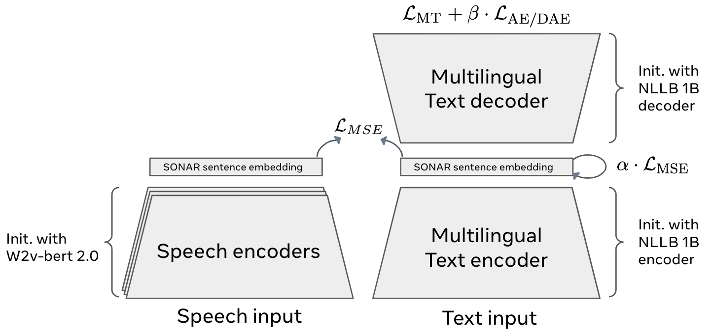

# SONAR ASL Inference Pipeline

We provide here some examples of using an end-to-end inference pipeline with a SONAR ASL encoder. SONAR (Sentence-level multimOdal and laNguage-Agnostic Representations) is a massively multilingual and multimodel sentence embedding space 
[[Paper]](https://ai.meta.com/research/publications/sonar-sentence-level-multimodal-and-language-agnostic-representations/) 
[[Code]](https://github.com/facebookresearch/SONAR). 

In order to train the SONAR ASL encoder, we used a teacher-student approach. An overview of the *general* SONAR architecture is shown below.



The SONAR ASL pipeline performs the following key steps:
  - Face detection (using the [dlib](https://github.com/davisking/dlib) library toolkit)
  - Video cropping 
  - Feature extraction (using SignHiera)
  - Translation from ASL into the specified target languages (see below)

## Example usage

### Demo script

We provide below an E2E demo which downloads a sample video (shown below), SignHiera and SONAR ASL models, and then performs inference into the following target languages: 

- English (eng_Latn)
- French (fra_Latn)
- German (deu_Latn)
- Chinese (zho_Hans)

NOTE: before running the demo, you must first download an appropriate dlib detection model. Examples can be found [here](https://github.com/davisking/dlib-models/). Additionally, the feature extraction and translation models were fine-tuned on the Daily Moth dataset. Therefore, it may not generalise well to unknown speakers/domains.

**Input video**


Ground truth translation: "A major concern is landslides in mountainous areas."

```
./demo.sh /path/to/dlib/detection_model.dat
```

Expected output

```
Translations:
--------------------------------------------------
eng_Latn: "a large concern is of landslides in mountainous areas."
fra_Latn: "Une grande préoccupation concerne les glissements de terrain dans les montagnes."
deu_Latn: "Es gibt große Bedenken über Erosionen in Gebirgszügen."
zho_Hans: "大多数山区都有岩石沉没的严重问题."
--------------------------------------------------
```

### Translate a raw input video from ASL into $N$ specified target languages

In order to manually translate a raw input video from ASL to any specified language, you can use the example command below. The `TGT_LANGS` denote the target languages which will be translated using SONAR, and can be specified using e.g. `TGT_LANGS='[eng_Latn, fra_Latn, deu_Latn, zho_Hans]'`, using any language(s) from [FLORES200](https://github.com/facebookresearch/flores/blob/main/flores200/README.md).

NOTE: fairseq2 will automatically download SONAR decoder models into your $TORCH_HOME/hub directory upon using the commands below.
```
python run.py \
    video_path=$INPUT_VIDEO
    preprocessing.detector_path=$DLIB_DETECTOR_PATH
    feature_extraction.pretrained_model_path=$FEATURE_EXTRACTOR  # SignHiera
    translation.pretrained_model_path=$SONAR_ENCODER_PATH
    translation.tgt_langs="$TGT_LANGS"
```
